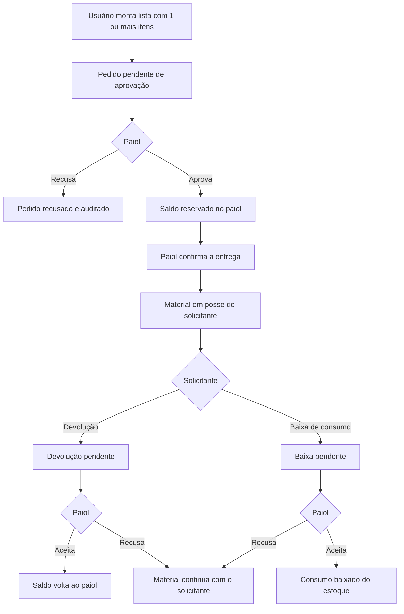

# Fluxo de retirada, entrega, devolução e baixa pelo paiol

## Contexto

O fluxo operacional pedido é:

1. Qualquer usuário autenticado solicita a retirada de uma lista com um ou mais materiais.
2. O responsável pelo paiol aprova a retirada e entrega o material.
3. O solicitante pede a devolução do material ou a baixa de material de consumo.
4. O responsável pelo paiol aceita ou recusa a devolução ou a baixa.
5. Existe um perfil de usuário específico de paiol.
6. Cada etapa fica em histórico auditável.

A verificação foi feita no código e no teste de contrato já existente.

## Verificação

Comando executado em `backend/`:

```text
python -m pytest tests/test_auth_inventory_contract.py::test_requests_and_approves_stock_movement -q
```

Resultado: o teste passou. Ele cobre só o fluxo atual de uma saída unitária aprovada por quem tem `inventory:movement:approve` (no teste, um administrador com permissão `*`). Na aprovação, o saldo sai da origem, entra no destino e a movimentação já nasce concluída (`completed_at` igual a `approved_at`).

O sistema **não está fiel** ao fluxo pedido. Não há falha de execução nesse teste; a lacuna é de regra de negócio.

## O que existe hoje

| Etapa pedida | Situação atual |
|---|---|
| Pedido com 1 ou mais materiais | `POST /inventory/movements/request` aceita um único `item_id`. A tela Solicitar saída também envia um item. |
| Qualquer usuário solicita | A solicitação exige `inventory:movement:request`. O menu Operação só aparece com essa permissão. Não há papel genérico que a conceda a todo usuário do inventário. |
| Perfil paiol | Não existe role `paiol`. Os papéis documentados são Desenvolvedor, Administrador, Operação, DGAes, Compras e Manutenção. O script `register_inventory_permissions.py` anexa o catálogo inteiro à role `admin-inventario`. |
| Paiol aprova | Quem tem `inventory:movement:approve` aprova ou reprova. Não há checagem de papel paiol. |
| Paiol entrega | A aprovação já transfere o estoque e encerra a movimentação. Não há etapa de entrega. |
| Devolução | Não há tipo, endpoint nem tela de devolução. `movement_type` é gravado sempre como `saida`. |
| Baixa de consumo | Não há fluxo de baixa. O tipo do item (`consumable` ou `permanent_component`) não altera a movimentação. |
| Aceite ou recusa do paiol | Só existe para a saída pendente. |
| Histórico auditável | Pedido, aprovação e reprovação de saída geram `audit_logs` (`stock_movement_requested`, `stock_movement_approved`, `stock_movement_rejected`). Devolução, baixa e entrega não existem para serem auditadas. A lista de operação não mostra o nome do item nem o motivo da decisão. |

Outros desvios que o fluxo novo precisa fechar:

- `stock_balances.reserved_quantity` existe e não é usado. Dois pedidos pendentes do mesmo saldo podem ser aprovados até o estoque acabar no segundo.
- Usuário com permissão `*` pode aprovar a própria saída. O bloqueio de autoaprovação só vale para quem não tem `*`.
- O motivo da decisão na tela é fixo (`Decisão autorizada pelo painel.` / `Decisão reprovada pelo painel.`).
- O modelo de dados previsto em `planos/implementacao/04-modelagem-dados-api.md` já cita devolução, mas a API não a implementa.
- O plano `05-modulos-inventario-operacao.md` ainda descreve Admin como aprovador e uma confirmação de retirada pela operação, diferente do responsável pelo paiol.

## Objetivo da correção

Substituir a saída unitária imediata por um pedido de retirada com linhas, decidido e entregue pelo perfil paiol, seguido de devolução ou baixa também decidida pelo paiol, com trilha de auditoria em cada transição.

## Fluxo alvo



Regras:

- Um pedido tem uma ou mais linhas. Cada linha tem item, quantidade e local de origem.
- A aprovação e a entrega são eventos separados, feitos pelo mesmo perfil paiol, para o histórico distinguir autorização e entrega física.
- Na aprovação, a quantidade é reservada. Na entrega, sai da reserva do paiol e passa à posse do solicitante.
- Depois da entrega, o solicitante pede devolução ou baixa por linha, no todo ou em parte da quantidade entregue.
- Baixa só é aceita para `item_type = consumable`. Permanente só volta por devolução.
- O solicitante não aprova, entrega, aceita nem recusa o próprio pedido, mesmo com permissão `*`.
- Recusar a retirada libera a reserva. Recusar devolução ou baixa mantém a posse com o solicitante.
- Estoque insuficiente na solicitação ou na aprovação bloqueia a operação.

## Perfil paiol

Criar a role `paiol` no `remobs-users` e vinculá-la aos responsáveis pelo paiol. Não colocar essas permissões na role global `admin`.

Permissões novas, registradas pelo script do inventário:

| Código | Quem recebe | Uso |
|---|---|---|
| `inventory:withdrawal:request` | Qualquer usuário do inventário que possa operar material | Abrir pedido com uma ou mais linhas |
| `inventory:withdrawal:approve` | `paiol` | Aprovar ou recusar a retirada e reservar saldo |
| `inventory:withdrawal:deliver` | `paiol` | Confirmar a entrega |
| `inventory:return:request` | Solicitante do pedido entregue | Pedir devolução |
| `inventory:return:decide` | `paiol` | Aceitar ou recusar devolução |
| `inventory:writeoff:request` | Solicitante do pedido entregue | Pedir baixa de consumo |
| `inventory:writeoff:decide` | `paiol` | Aceitar ou recusar baixa |
| `inventory:custody:read` | Solicitante, `paiol` e quem consulta auditoria | Ver pedido, linhas, posse e histórico |

`inventory:movement:request` e `inventory:movement:approve` permanecem só para compatibilidade do fluxo antigo até a migração da tela. O fluxo novo não as reutiliza como autorização do paiol.

Leitura de `inventory:item:read` continua necessária para escolher materiais. `audit:log:read` continua com administração; o histórico do pedido fica visível a solicitante e paiol pela permissão de custódia, sem abrir o log geral.

## Modelo

Novas tabelas, em migração Alembic:

- `withdrawal_orders`: solicitante, motivo, status, aprovador, entregador e datas de cada transição.
- `withdrawal_lines`: item, quantidade pedida, origem, quantidade reservada, quantidade entregue, quantidade devolvida, quantidade baixada e status da linha.
- `custody_positions`: item, usuário custodiante, pedido de origem, quantidade em posse.
- `custody_events`: devolução ou baixa, quantidade, motivo, status e decisão do paiol.

Status do pedido: `pending_approval`, `rejected`, `approved`, `delivered`, `closed`.

Status do evento de devolução ou baixa: `pending`, `accepted`, `refused`.

A movimentação de estoque continua em `stock_movements`, agora com `movement_type` em `reserva`, `entrega`, `devolucao` e `baixa`, e com referência ao pedido e à linha.

## Auditoria

Cada transição chama `log_action` com ator, papéis, motivo, antes e depois:

- `withdrawal_requested`
- `withdrawal_approved`
- `withdrawal_rejected`
- `withdrawal_delivered`
- `return_requested`
- `return_accepted`
- `return_refused`
- `writeoff_requested`
- `writeoff_accepted`
- `writeoff_refused`

O histórico do item e a tela do pedido mostram a linha do tempo desses eventos.

## API

- `POST /inventory/withdrawals` cria o pedido com `lines` (mínimo 1).
- `GET /inventory/withdrawals` lista os pedidos. Solicitante vê os próprios; paiol vê a fila.
- `GET /inventory/withdrawals/{id}` devolve pedido, linhas, custódia e trilha.
- `POST /inventory/withdrawals/{id}/approve`
- `POST /inventory/withdrawals/{id}/reject`
- `POST /inventory/withdrawals/{id}/deliver`
- `POST /inventory/withdrawals/{id}/lines/{line_id}/return`
- `POST /inventory/custody-events/{id}/accept`
- `POST /inventory/custody-events/{id}/refuse`

Decisões exigem motivo com pelo menos 3 caracteres, informado pelo usuário.

## Interface

- Solicitar retirada: incluir vários materiais, quantidades e um motivo do pedido.
- Fila do paiol: aprovar ou recusar, depois confirmar entrega, com motivo digitado.
- Posse do solicitante: pedir devolução ou baixa da quantidade ainda em posse.
- Fila do paiol: aceitar ou recusar devolução e baixa.
- Detalhe do pedido: status, responsáveis, datas e histórico auditável.
- Detalhe do item: mesmas movimentações no histórico que já existe.

## Escopo de implementação

- `remobs-inventario`: modelos, migração, serviço, rotas, schemas, telas, permissões no script de registro e testes de contrato.
- `remobs-users`: criar a role `paiol` e anexar somente as permissões de decisão e leitura de custódia. A role não é seed global de admin.
- `remobs-user-front`: conseguir atribuir a role `paiol` a um usuário, se a tela de papéis já lista roles da API. Sem tela nova se a gestão de roles já cobre um papel criado pela API.

## Fora deste fluxo

- Inventário físico periódico.
- Reserva por plataforma ou ordem de manutenção.
- Confirmação de retirada feita pelo solicitante. Quem entrega é o paiol.
- Baixa de componente permanente.

## Validação prevista

1. Usuário sem permissão de paiol cria pedido com dois itens e não consegue aprovar o próprio pedido.
2. Paiol recusa o pedido: nada muda no saldo e o log registra a recusa.
3. Paiol aprova: quantidade fica em `reserved_quantity` e o disponível cai.
4. Segundo pedido acima do disponível é rejeitado.
5. Paiol entrega: reserva cai, posse do solicitante sobe, saldo do paiol cai.
6. Solicitante pede devolução parcial de permanente: paiol aceita e o saldo volta; o restante continua em posse.
7. Solicitante pede baixa de consumo: paiol aceita e a quantidade sai da posse sem voltar ao paiol.
8. Baixa de permanente é recusada pela API.
9. Paiol recusa devolução ou baixa: a posse não muda e o log registra a recusa.
10. Histórico do pedido e do item contém ator, papel, motivo e datas de todas as etapas.

## Resultado

Diagnóstico concluído em 22/09/2026. O fluxo atual de saída unitária funciona e não implementa o processo pedido.

O plano de implementação, com commits separados, deploy em produção e roteiro de teste, está em `planos/2026-09-22-implementacao-retirada-paiol.md`.

A implementação local foi concluída em 22/09/2026. A reserva acontece na solicitação. Commit e deploy ainda não foram feitos.
